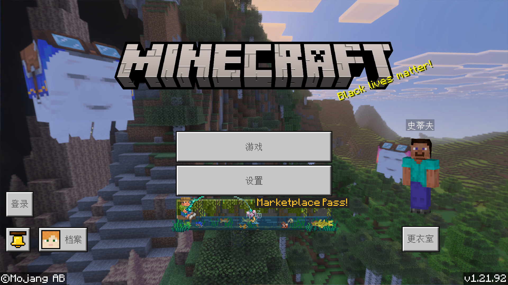
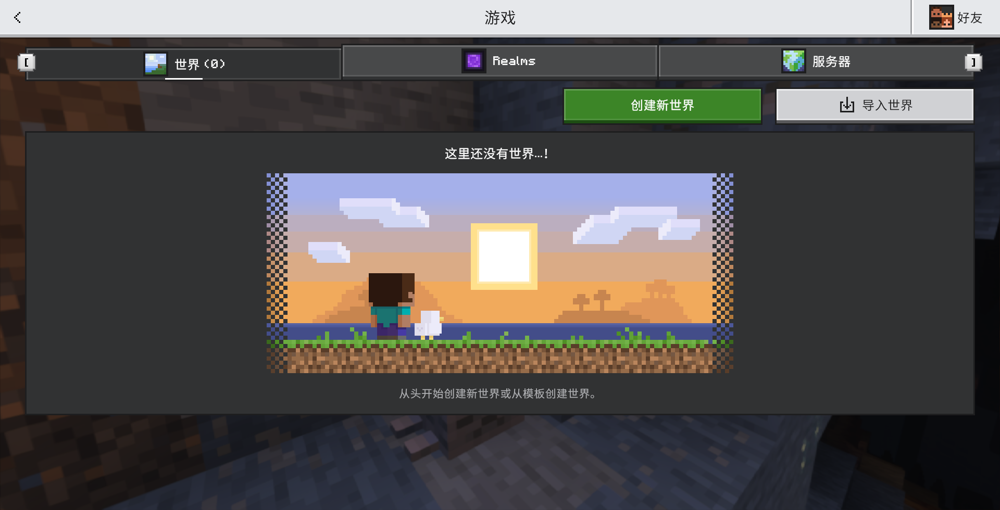
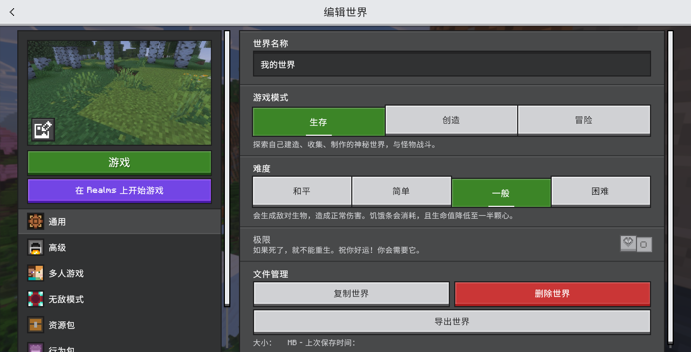

# 基岩版教程
<ArticleMetadata />

> [资源分享](https://www.123912.com/s/0l7bVv-v5yHh)

## 游戏下载与安装
-  [MCAPPX 版本库](https://www.mcappx.com/)（Windows 版，含**正版验证**机制）
  - [Unlock Minecraft 工具](https://wwus.lanzouu.com/imFD62mg1nte)
-  [Minecraft for Android 版本库](https://bbk.endyun.ltd/download)（Android 版，**推荐**）
- <i class="fa-solid fa-paper-plane" style="color: #0d6efd;"></i> [我的世界国际版全版本下载](https://mcapks.com)（Android 版）
-  [我的世界国际版下载](https://mc.minebbs.com/?platform=3&environment=1)（Windows, Android, iOS 均有）
-  [Xbox 官网下载](https://www.xbox.com/zh-cn/games/store/minecraft-java-bedrock-edition-for-pc/9nxp44l49shj)

## 启动游戏

## 更多
- 自定义皮肤 
  游戏内上传皮肤文件即可
- 添加游戏资源
  - 游戏内购买
  - 在[资源网站](https://mcjpg.org/nav/#%E8%B5%84%E6%BA%90%E7%AB%99)下载游戏资源（地图/资源包/行为包/材质），双击自动添加到游戏（注意游戏版本）
- 导入/导出世界
  
  
  

## 视频教程

### <i class="fa-solid fa-desktop"></i> 桌面端
- Windows 平台
  <BilibiliVideo bvid="BV1pEFueQEH9" />

### <i class="fa-solid fa-mobile"></i> 移动端
- Android 平台
  <BilibiliVideo bvid="BV1Wx38zTEYx" />