# 电脑版教程

> [**资源分享**](https://www.123pan.com/s/0l7bVv-d5yHh.html)<br>
> 也有简单的[基岩版教程](/start/BE/)

::: tip 注意
首先你需要一定基础电脑操作能力，本教程以 Windows 平台为例。
:::

## 基础技巧

### 启动器与 Java 的安装

- 启动器（任选一个）
  - [PCL2 下载](https://afdian.com/p/0164034c016c11ebafcb52540025c377)
  - [HMCL 下载](https://hmcl.huangyuhui.net/download/)
  - [Minecraft 官方启动器](https://www.minecraft.net/zh-hans/download)

::: tip 提示
- 现在启动器基本都支持自动安装 Java 环境
- 游戏资源路径
  - 官方启动器：`C:\Users\{用户名}\AppData\Roaming\.minecraft`
  - 第三方启动器：同目录下 `.minecraft`
:::

- Java
  - [Java 24/21](https://www.oracle.com/cn/java/technologies/downloads/)
  - [Java 8](https://www.java.com/zh-CN/download/)

| Minecraft 版本 | Java 最低版本/推荐版本 |
|:-:|:-:|
| <1.7 | 8（不能高于8） |
| 1.8 ~ 1.15 | 8/11 |
| 1.16 | 11/16 |
| 1.17 ~ 1.19 | 13/17 |
| 1.20 | 17/21 |
| 1.21 | 21 |

### 简单配置启动器

`版本隔离`与`自动选择合适的 Java`。

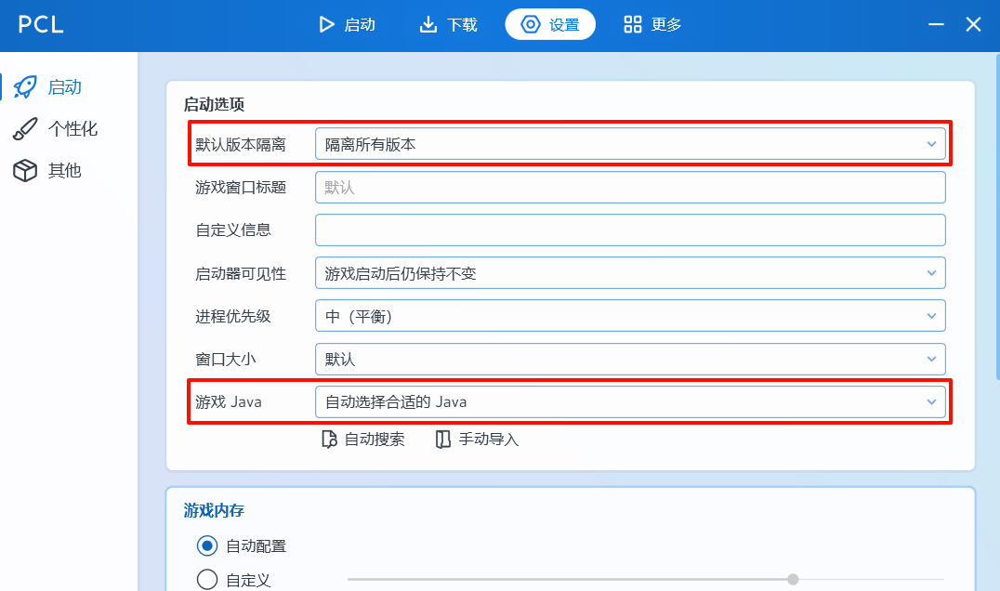

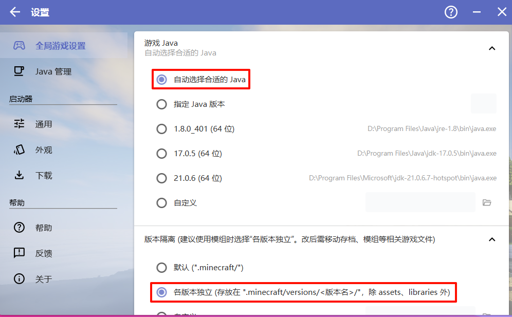

::: info  信息
开启版本隔离后各游戏版本会分别存放在 `.minecraft\versions\{版本名称}` 文件夹下，各版本存档、模组、资源包、光影包等相互独立，便于管理。

该目录下主要文件夹/文件说明：
```txt
saves #存档
mods #模组
resourcepacks #资源包
shaderpacks #光影包
screenshots #游戏截图
options.txt #游戏设置
```
:::

### 下载游戏文件

安装游戏版本与模组加载器（如果需要）

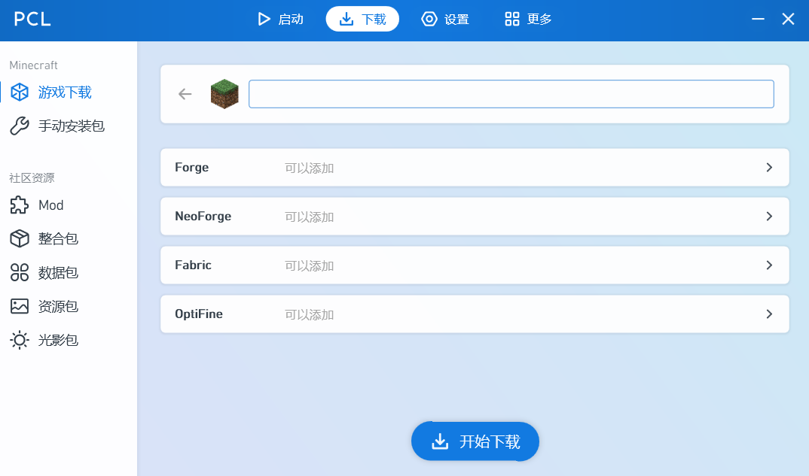

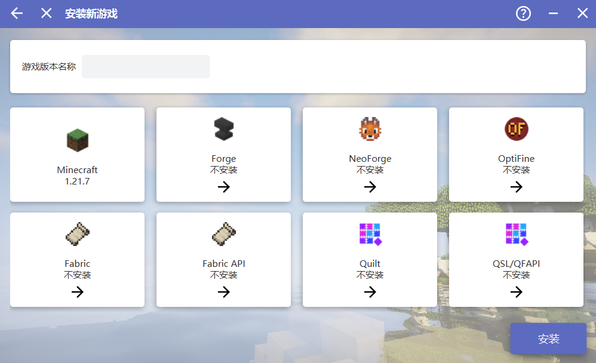

::: tip 注意
如需装光影，1.14 以前需装 OptiFine（高清修复），1.14以后 Fabric 端推荐安装 Sodium（钠）和 Iris Shaders，Forge 端推荐安装 Rubidium（铷）和 Lithium（锂）
:::

### 游戏资源下载（模组/整合包/材质包/光影包）

- 通过启动器下载

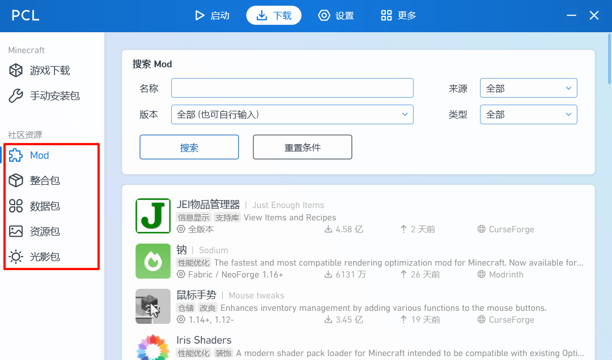

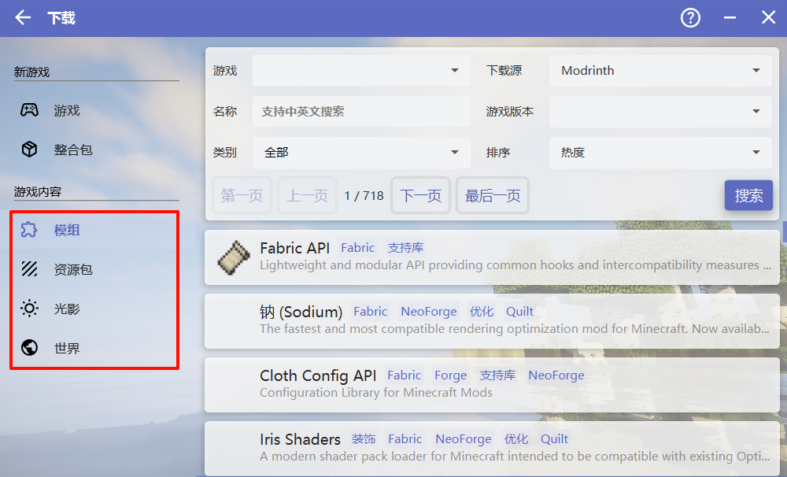

- 通过网站下载<br>
  通过国内 [MC 百科](https://www.mcmod.cn) 等网站或国外 [CurseForge](https://www.curseforge.com/minecraft)、[Modrinth](https://modrinth.com/) 等网站下载对应版本游戏资源

::: tip 注意
下载模组时注意要求的游戏版本与模组加载器，如果有**前置模组**则也要下载

注意将下载的文件放在**对应版本文件夹**的相应文件夹下
:::

### 启动游戏
使用正版或离线账户启动游戏

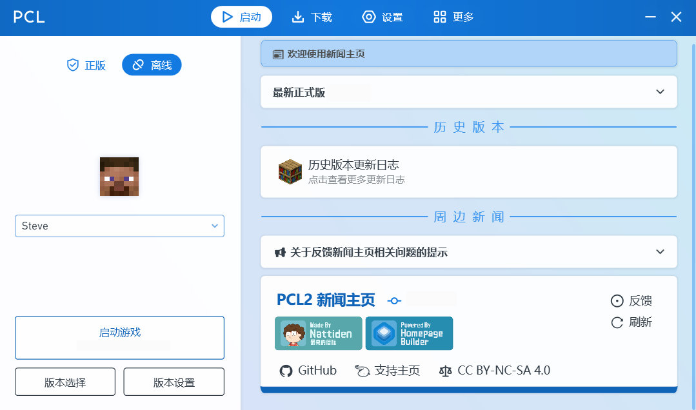

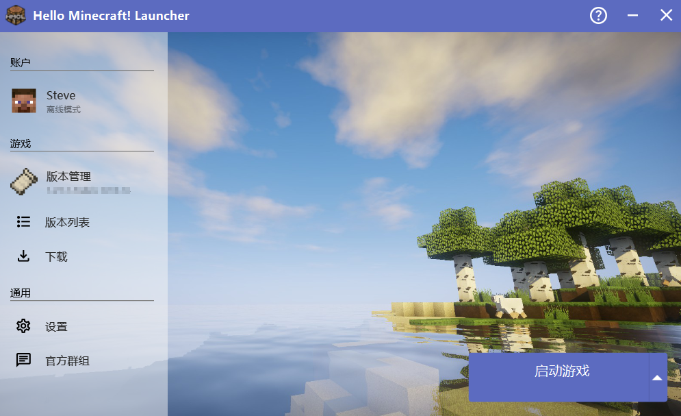

## 进阶技巧

### 自定义皮肤/披风

- 进入 [LittleSkin](https://littleskin.cn/) 网站，注册账号并登录

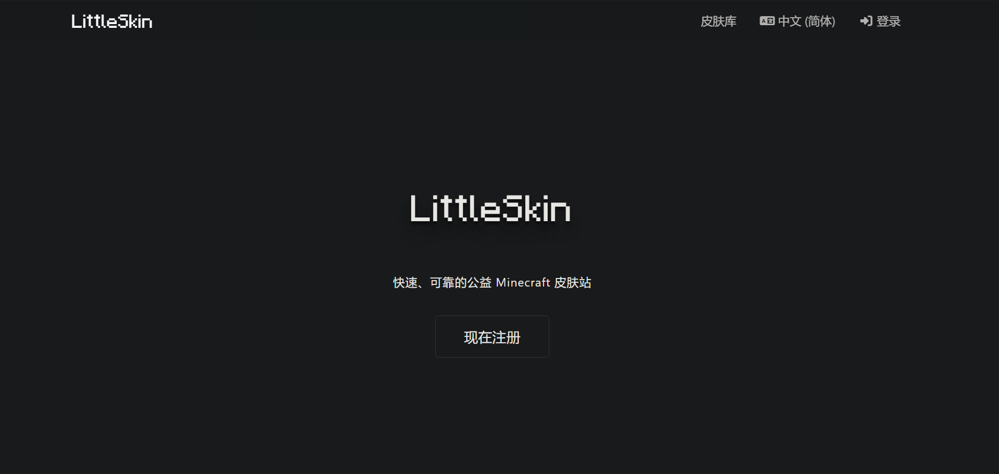

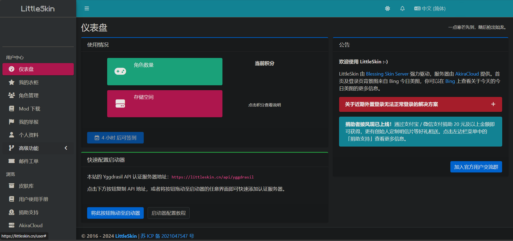

- 点击角色管理-添加新角色

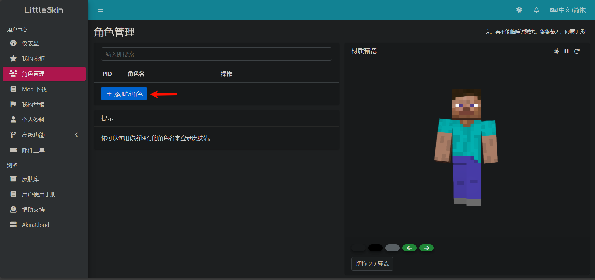

- 点击侧栏皮肤库，寻找喜欢的皮肤或披风

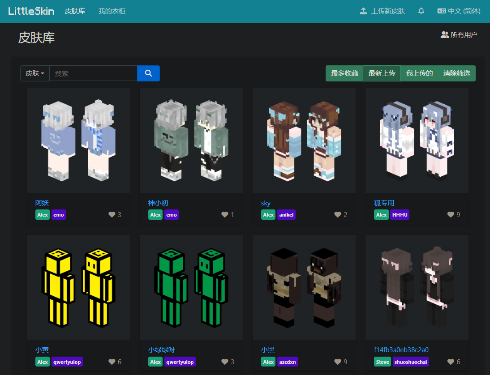

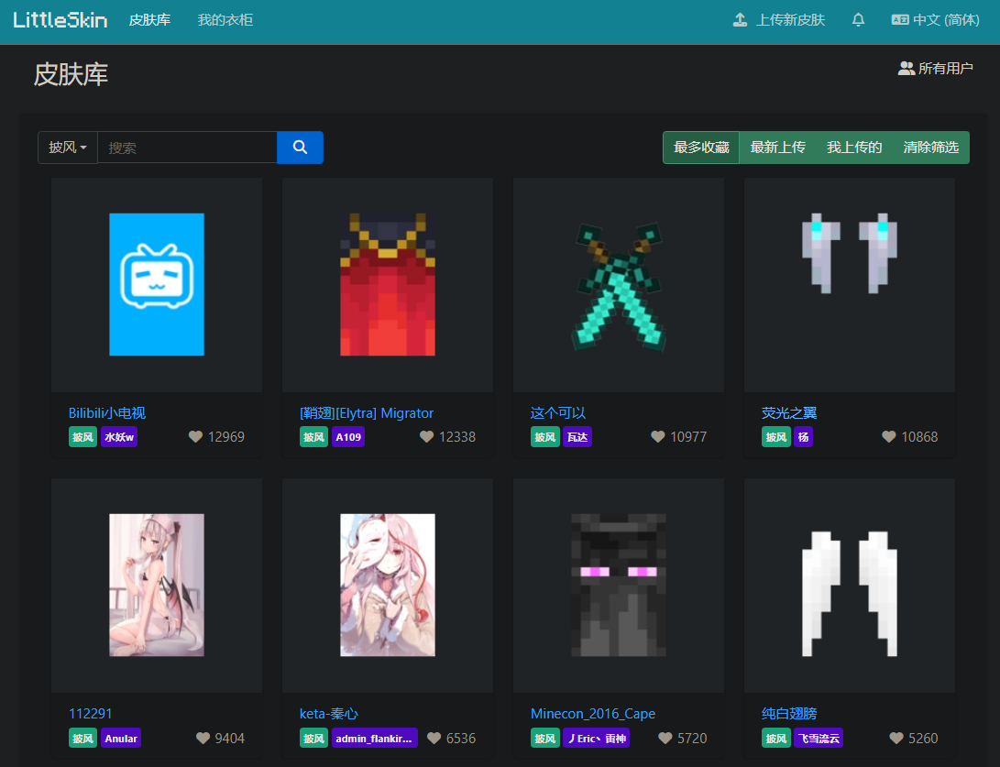

- 进入详情页后，点击添加至衣柜

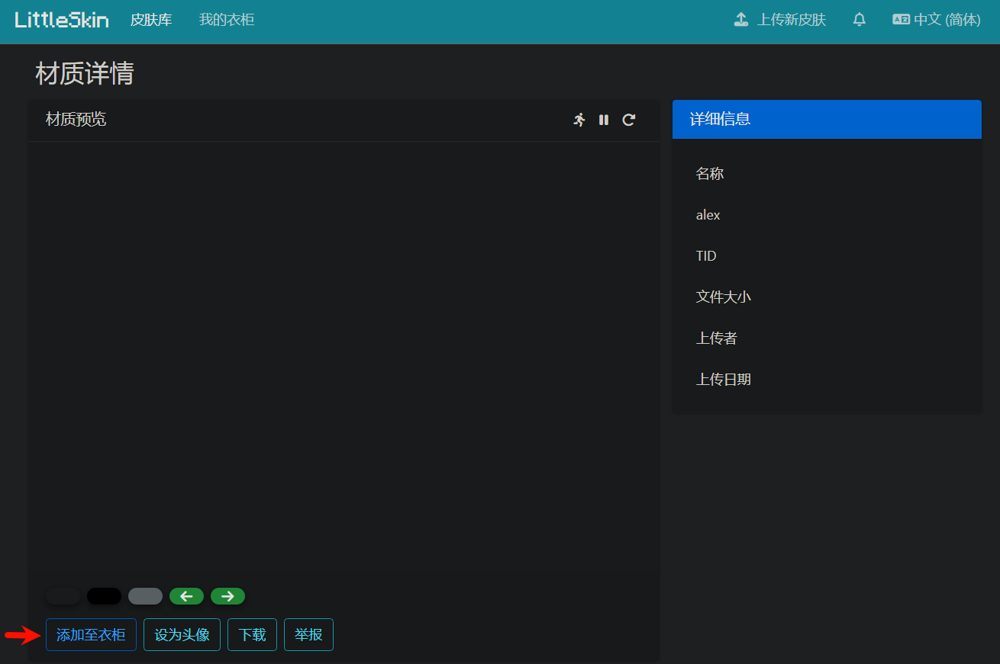

- 回到我的衣柜，即可查看已保存的皮肤或披风，也可以自己上传材质

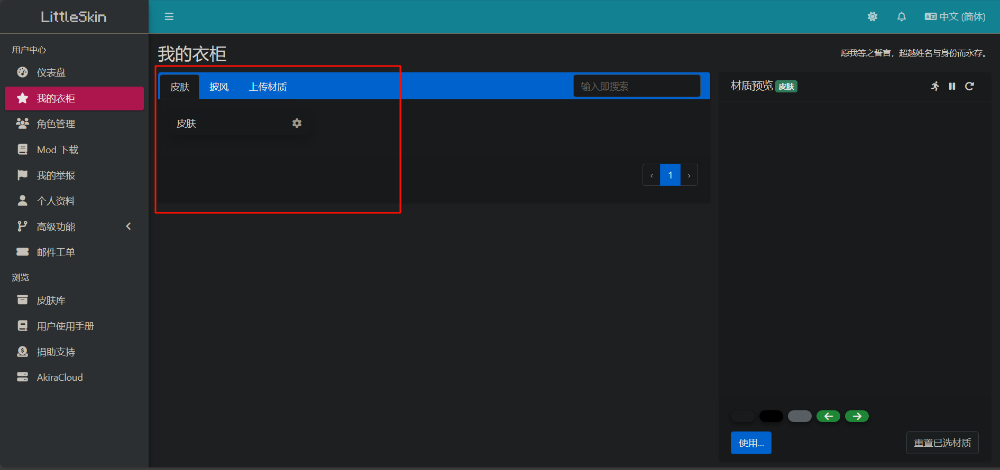

- 回到仪表盘，如果使用HMCL启动器，则把将此按钮拖动到启动器拖动到启动器，完成登录
- 如果使用 PCL2 启动器，则点击启动页面的版本设置-设置-服务器-登录方式，选择第三方行登录：`Authlib Injector 或 LittleSkin`，点击下方设置为LittleSkin，返回后输入邮箱、密码，点击登录

### 存档导入/导出

- 导入：将存档压缩包解压到 `saves` 文件夹下，重启游戏即可
- 导出：将 `saves` 文件夹下的存档文件夹压缩，得到的压缩包文件即为导出的文件

::: warning 注意
导入的存档的游戏版本应 ≤ 当前游戏版本

存档应用一个文件夹包裹后放在 `saves` 文件夹下
:::

### 修改游戏数据
- 可以使用[中文版本的NBTExplorer](https://github.com/wifi-left/ChineseNBTExplorer)编辑 `level.dat` 文件来修改存档设置

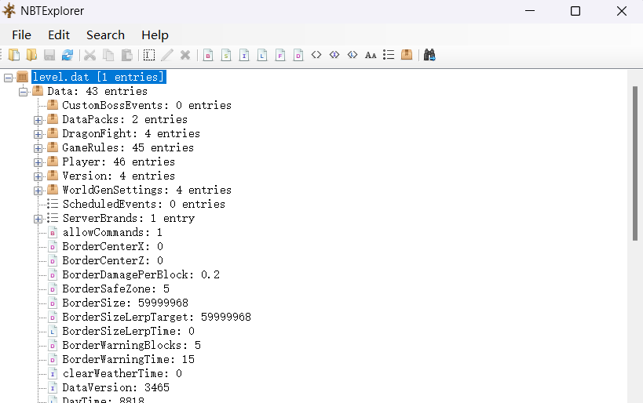

- 也可使用 HMCL 编辑存档设置
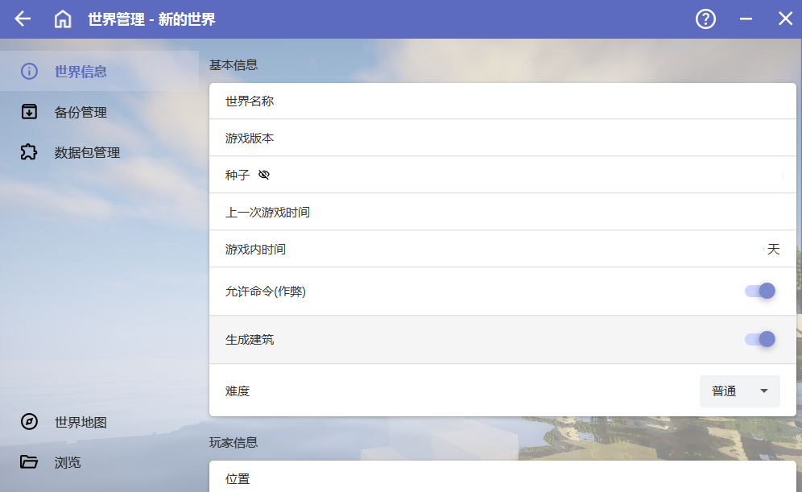

## 其他

### 游戏快捷键

| 按键 | 功能说明 |
|:-:|:-:|
| **鼠标左键** | 破坏方块/攻击生物（按住持续破坏） |
| **鼠标右键** | 放置方块/使用物品（如拉弓、打开容器） |
| **鼠标中键** | 创造模式下复制准星对准的方块或生物蛋；生存模式下切换手持物品 |
| **`Esc`** | 打开游戏菜单 |
| **`W` `A` `S` `D`** | 前进/左移/后退/右移移动；双击W疾跑 |
| **空格键** | 跳跃；创造模式下双击起飞 |
| **左 `Shift`** | 潜行；飞行模式下下降 |
| **`Q`** | 丢弃单个物品；`Ctrl` + `Q` 丢弃整组（ Mac 需按 `Ctrl` + `Cmd` + `Q`） |
| **`E`** | 打开物品栏 |
| **`F`** | 交换主副手物品 |
| **`T`** | 打开聊天栏 |
| **`L`** | 查看进度 |
| **`1-9`** | 快捷栏物品切换；物品栏界面中快速移动物品 |
| **`F1`** | 隐藏界面（与F2配合截图无HUD） |
| **`F2`** | 截图并保存至游戏文件夹   |
| **`F3`** | 显示调试信息（坐标、帧率、生物群系等） |
| **`F3` + `A`** | 重载所有区块 |
| **`F3` + `B`** | 显示实体碰撞箱 |
| **`F3` + `C`** | 短按复制坐标；长按10秒强制崩溃 |
| **`F3` + `G`** | 显示区块边界 |
| **`F3` + `H`** | 显示物品耐久度、ID等高级信息 |
| **`F3` + `N`** | 切换旁观模式与上一模式 |
| **`F5`** | 切换第一/第三人称视角 |
| **`F11`** | 切换全屏/窗口模式 |
| **`Ctrl` + `中键`** | 复制带 NBT 标签的方块（如箱子内容、告示牌文字） |
| **`Ctrl` + 双击物品** | 快速整理分散的同种物品 |
| **`Tab`** | 多人游戏中显示玩家列表；聊天时补全命令 |

### 键盘绑定图

