# <i class="fa-solid fa-mobile"></i> 移动端教程
<ArticleMetadata />

> 本文目前仅介绍安卓端教程，先展示教程视频，文档后续更新。

## 下载＆安装启动器
-  ZalithLauncher <a href="https://zalithlauncher.cn/download.html" target="_blank"><i class="fa-solid fa-download"></i></a>
  - 文档站 <a href="https://zalithlauncher.cn/" target="_blank"><i class="fa-solid fa-book"></i></a>
-  FoldCraftLauncher <a href="https://github.com/FCL-Team/FoldCraftLauncher/releases" target="_blank"><i class="fa-solid fa-download"></i></a>

> 在首次进入启动器时会提示安装必要依赖和 Java 环境，同意并继续即可，注意按提示授予相关存储权限。
## 创建账户
::: code-group


```md:img [ ZalithLauncher]
   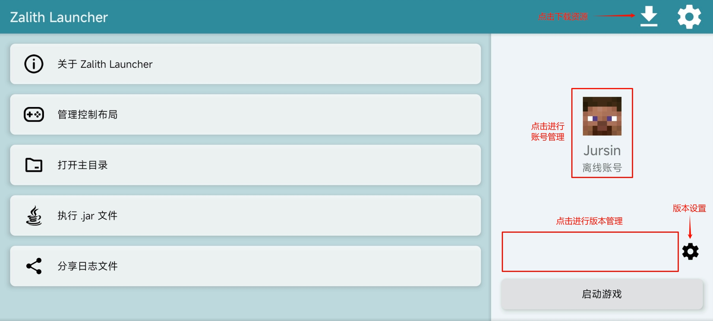
   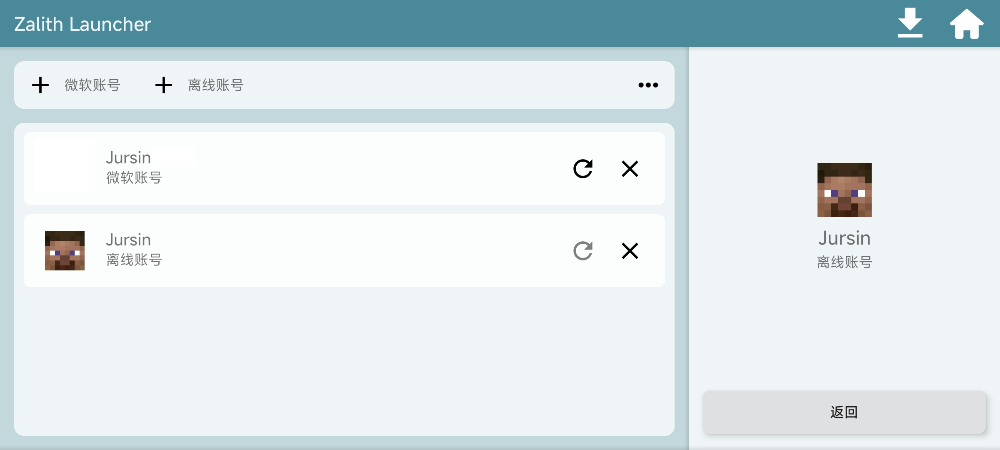

```

```md:img [ FoldCraftLauncher]
   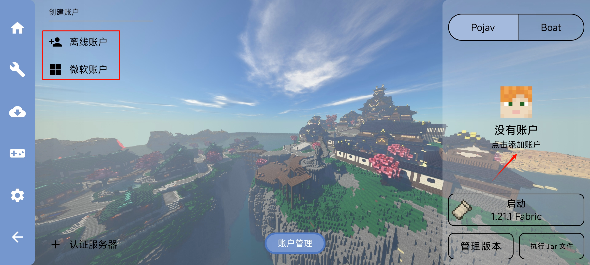

```

:::

> 账户名仅可包含字母、数字、<u>下划线</u>，***不能包含中文、特殊字符***。
## 下载游戏版本
::: code-group


```md:img [ ZalithLauncher]
   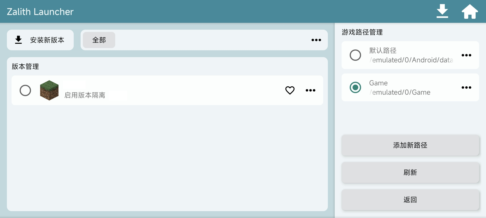
   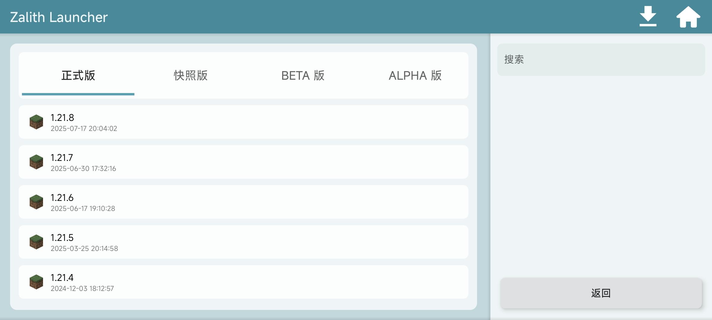
   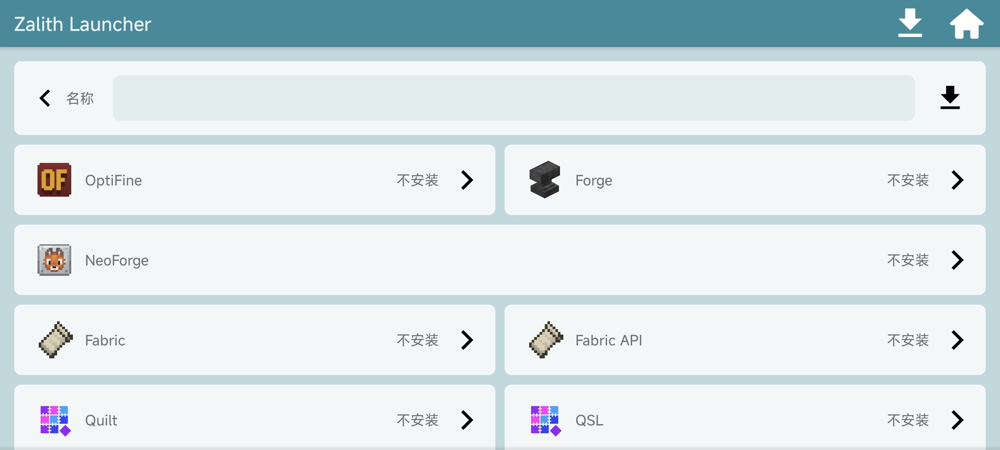

```

```md:img [ FoldCraftLauncher]
   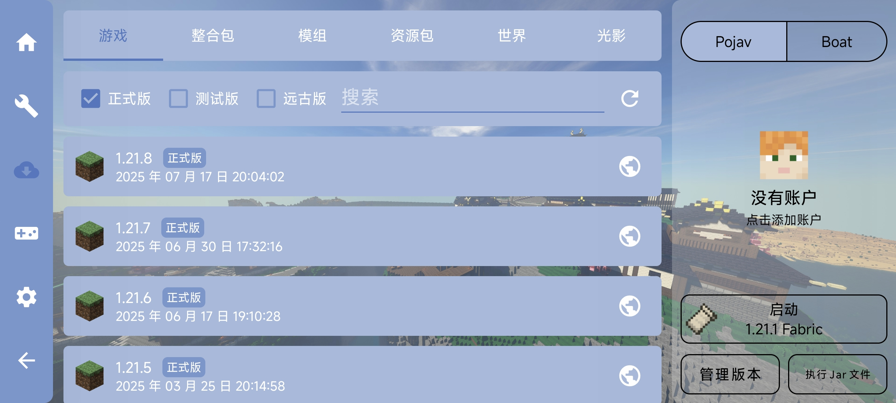
   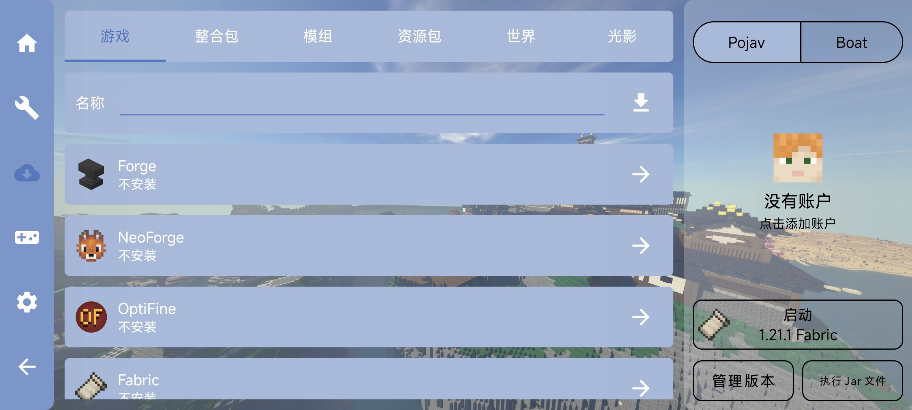

```

> 建议将游戏安装到外部公共目录，而不是软件私有目录，防止卸载软件时丢失游戏数据。
:::

## 下载资源
::: code-group


```md:img [ ZalithLauncher]
   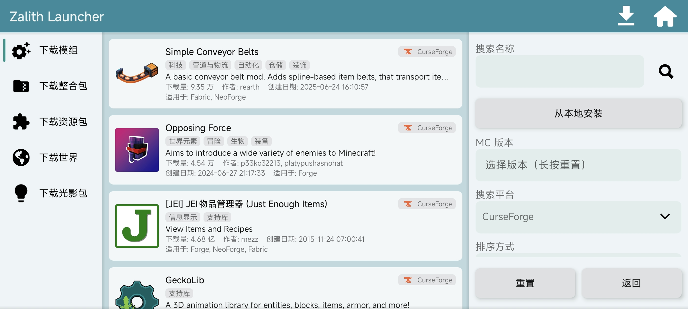

```

```md:img [ FoldCraftLauncher]
   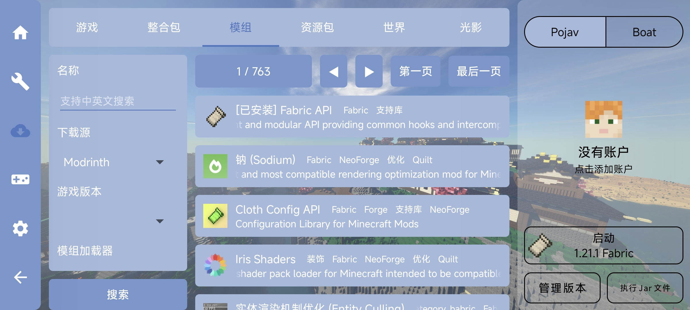

```

:::

> 注意游戏版本和模组加载器<br/>
> 如需安装  [Sodium（钠）](https://modrinth.com/mod/sodium) 需要使用 [LTW 渲染器](https://github.com/ShirosakiMio/FCLRendererPlugin/releases/tag/Renderer) （<a href="https://pan.quark.cn/s/a9f6e9d860d9#/list/share" target="_blank">网盘下载</a>）
## 设置
::: code-group


```md:img [ ZalithLauncher]
   - 刘海屏设备建议打开
     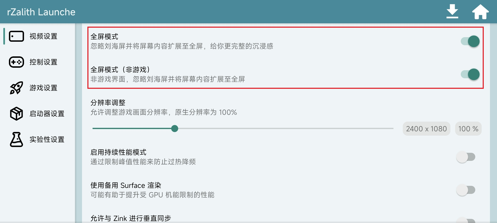
   - 建议分配合理内存
     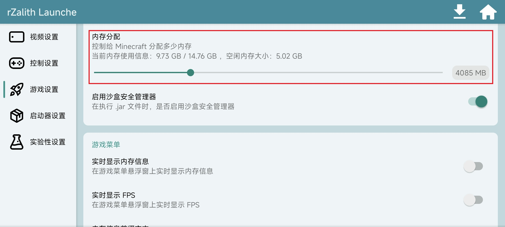
   - 建议开启，方便判断游戏是否正常启动
     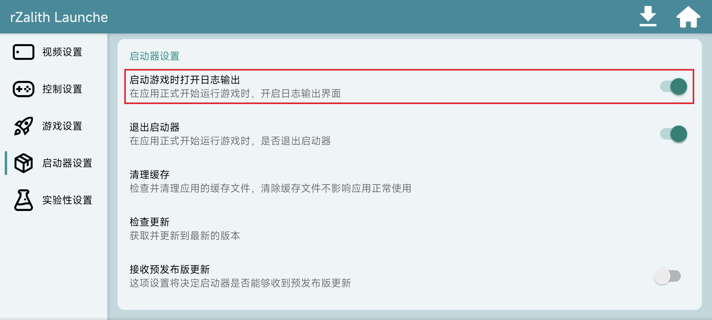

```

```md:img [ FoldCraftLauncher]
   - 建议分配合理内存
     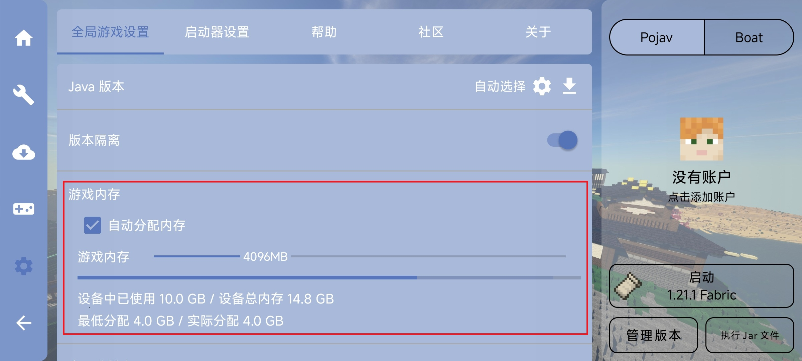
   - 刘海屏设备建议打开
     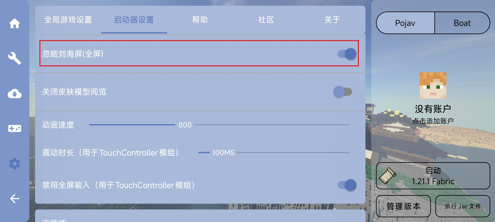

```

:::

## 启动游戏并查看日志输出
::: code-group


```md:img [ ZalithLauncher]
   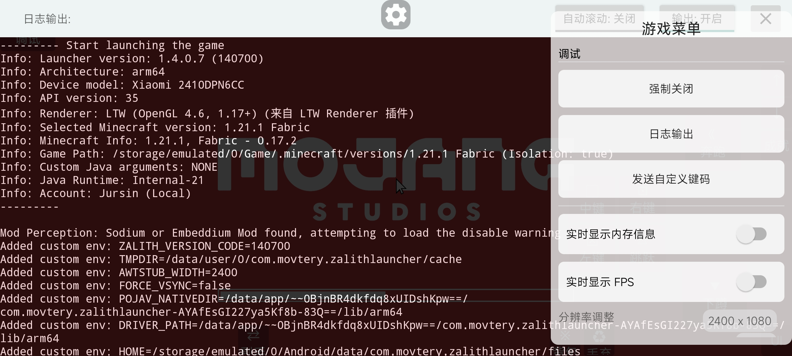

```

```md:img [ FoldCraftLauncher]
   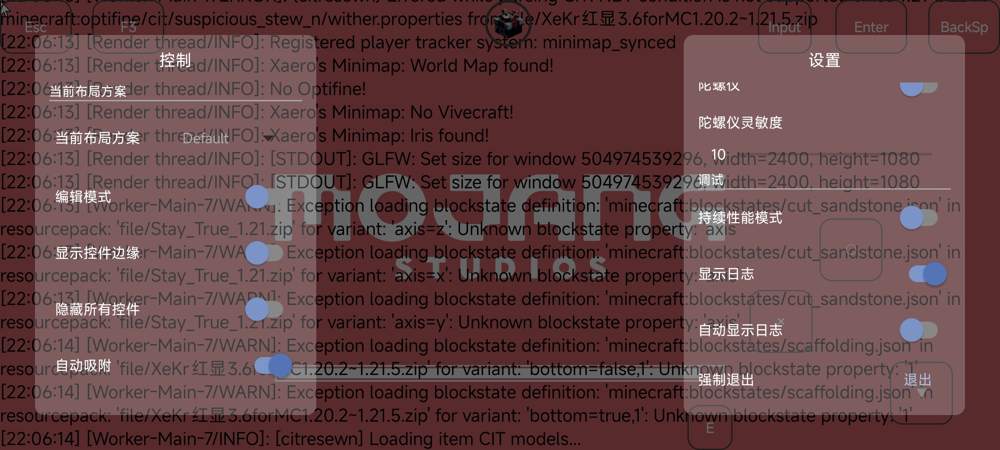

```

:::

## 联机
- 见后文[通过 Sakura Frp | 樱花内网穿透联机](/start/JE/%E8%81%94%E6%9C%BA/#%E9%80%9A%E8%BF%87-sakura-frp-%E6%A8%B1%E8%8A%B1%E5%86%85%E7%BD%91%E7%A9%BF%E9%80%8F-%E4%B8%BB%E6%B5%81%E5%B9%B3%E5%8F%B0%E5%9D%87%E6%94%AF%E6%8C%81)

## 整合包安装教程+问题详解
<BilibiliVideo bvid="BV1kfupzCECu" />

::: tip
[ZalithLauncher 视频](https://www.bilibili.com/video/BV12BXvYEEx1)<br/>
[FoldCraftLauncher 视频](https://www.bilibili.com/video/BV1pLKVzGEXA)
:::