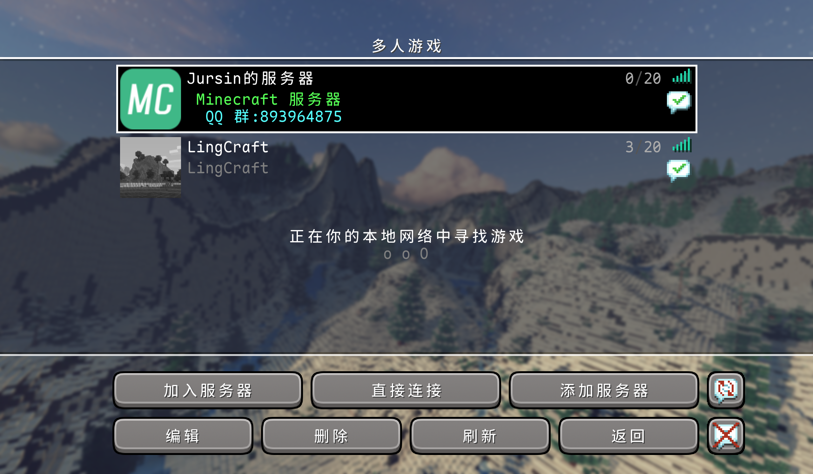
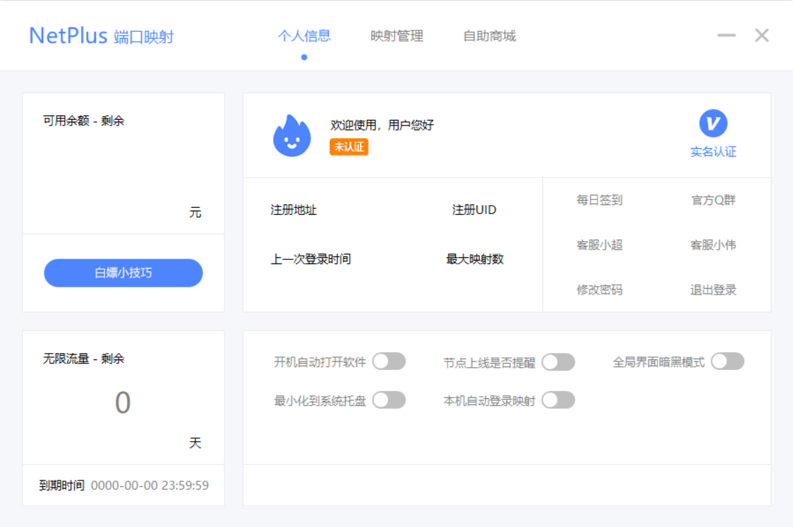
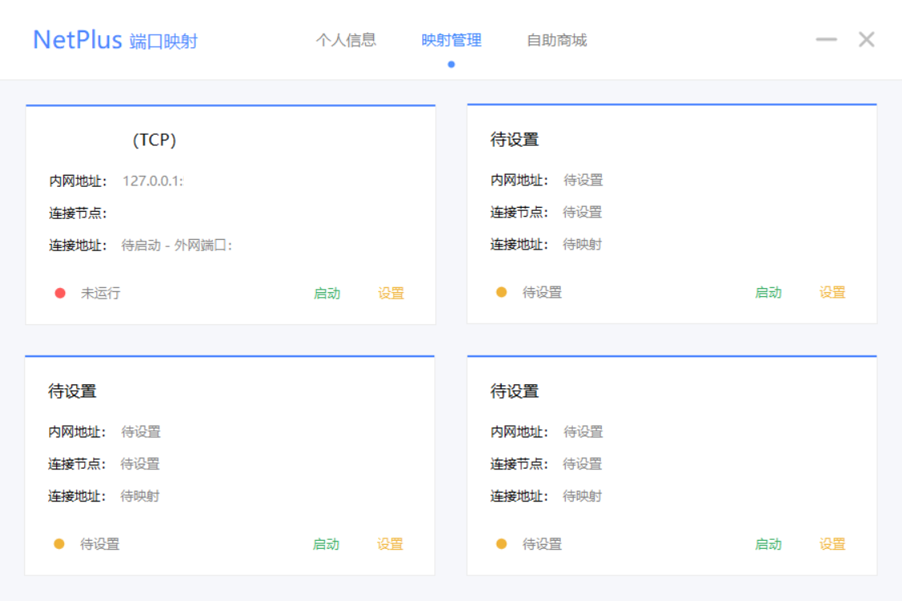
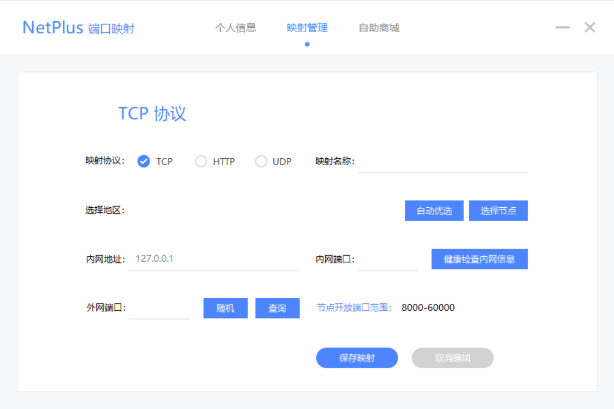
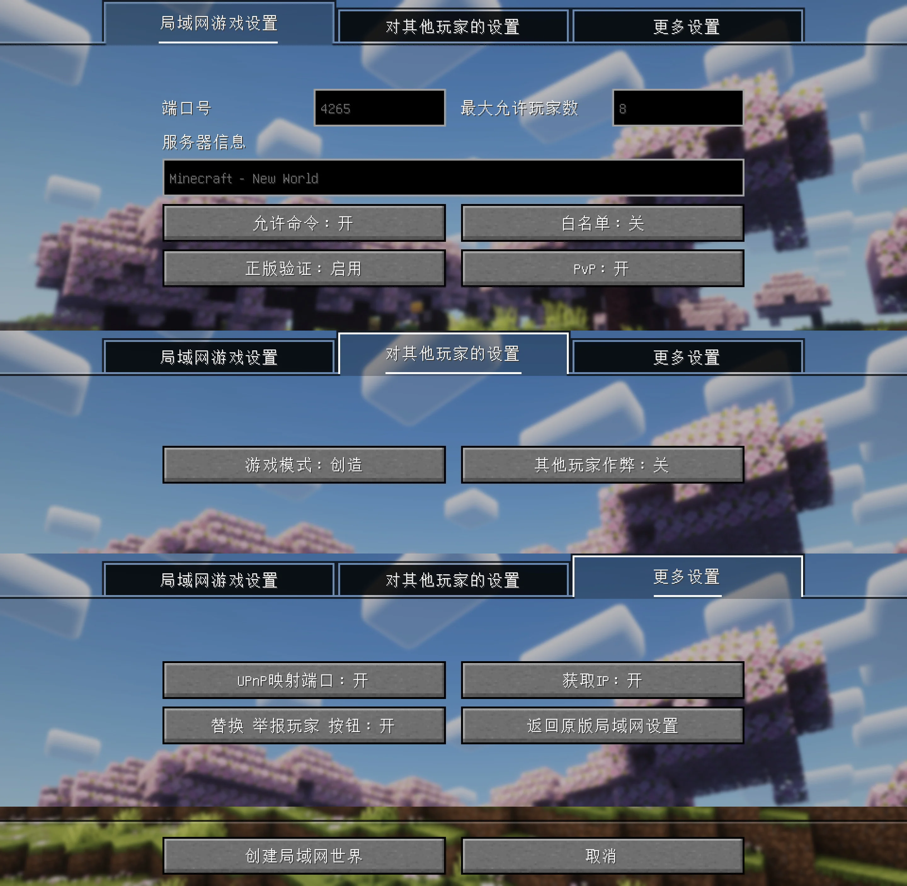
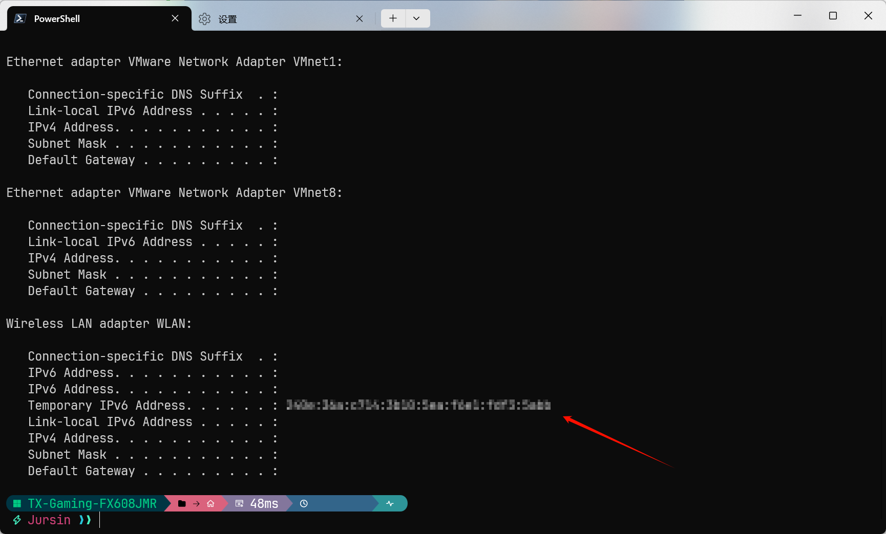

# <i class="fa-solid fa-globe"></i> 联机教程
<ArticleMetadata />

> 以 Windows 端为例，[手机端教程](/start/JE/mobile/#联机教程)见前文。
## 局域网联机

确保和好友在同一局域网内，启动游戏后点击`多人游戏`，进入对应房间即可



## 内网穿透联机
### 通过 NetPlus <a href="https://netplus.xingl.net/"><i class="fa-solid fa-download"></i></a>
- 注册账号后进入主界面



> 点击`每日签到`可随机获得 0.1-0.3 元余额

- 点击`映射管理`，选择任意一个映射，点击`设置`；



- 按以下表格填写
  | 映射<br>协议 | 映射<br>名称 | 选择地区 | 内网地址 | 内网端口 | 外网端口 |
  |:-:|:-:|:-:|:-:|:-:|:-:|
  | 默认 `TCP` | 自行填写 | 选择延迟最低的一项 | 127.0.0.1 | 填写游戏内聊天框显示的端口号（需先对开启局域网内开放） | 点击随机 |

- 然后`保存映射`



- 返回映射管理后，点击`启动`，点击`复制连接地址`，分享给好友

- 好友将连接地址复制后，点击游戏内`多人游戏`，点击`直接连接`并粘贴地址即可进入房间；或点击添加服务器并粘贴地址，保存到列表后进入

::: tip
可以通过模组 [[更高级联机设置] LAN World Plug-n-Play](https://modrinth.com/mod/mcwifipnp) 实现更多联机设置


:::

## IPv6 联机
- 通过 [IPv6地址查询](https://ipw.cn/ipv6/) 网站查询 IPv6 地址
- 或通过终端查询 IPv6 地址：
  - 打开 Windows PowerShell，输入以下内容并回车：
    ```shell
    ipconfig
    ```
  - 查看输出内容
    ```shell
    Wireless LAN adapter WLAN:
       Temporary IPv6 Address:
    ```
    该字段后地址即为 IPv6 地址
    
- 点击游戏内`多人游戏`，点击`添加服务器`并粘贴地址，格式为 `[IPv6 地址]:{端口号}`
## 服务器联机
- [搭建好服务器](/start/server/)后，将服务器地址分享给好友
- 好友将服务器地址复制后，点击游戏内`多人游戏`，点击`添加服务器`并粘贴地址，保存到列表后进入；或点击`直接连接`并粘贴地址即可进入房间

> [更多联机方式教程](https://www.bilibili.com/video/BV14SXnYyEit)