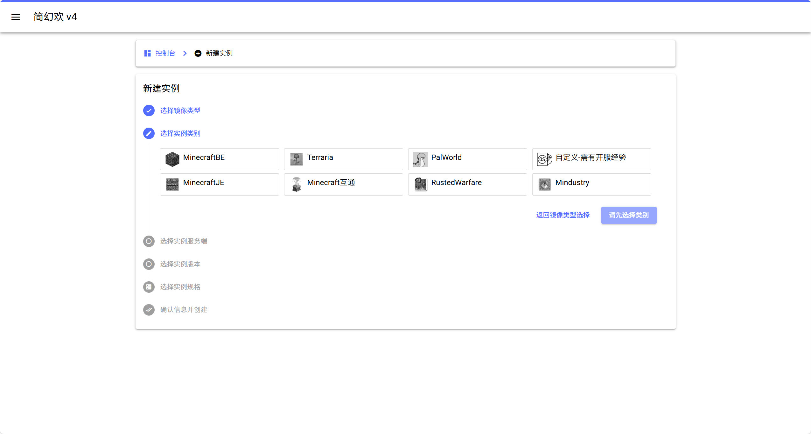
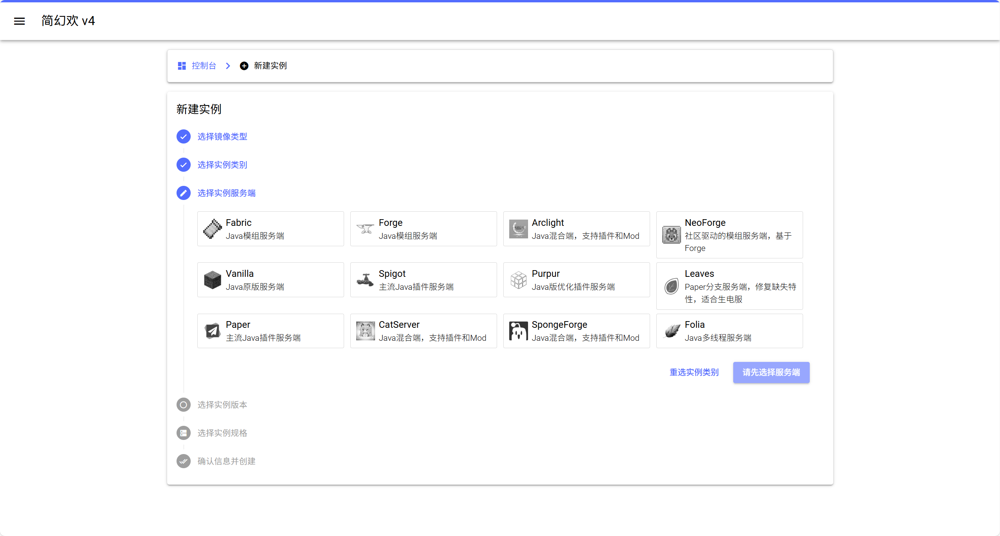
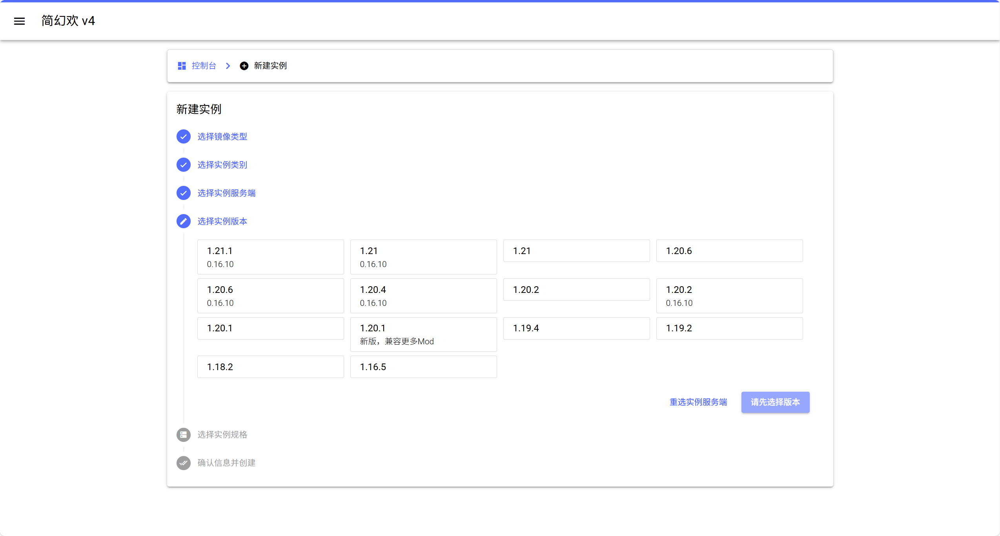
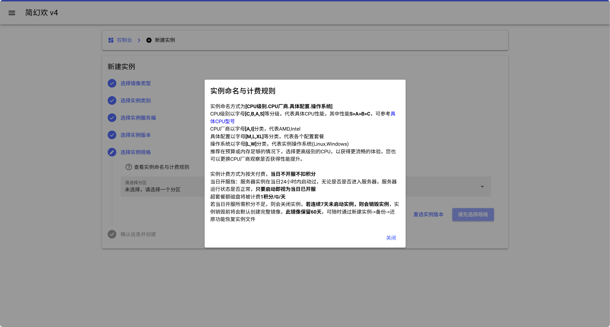
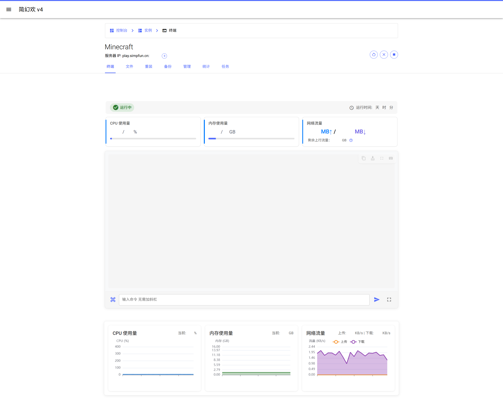
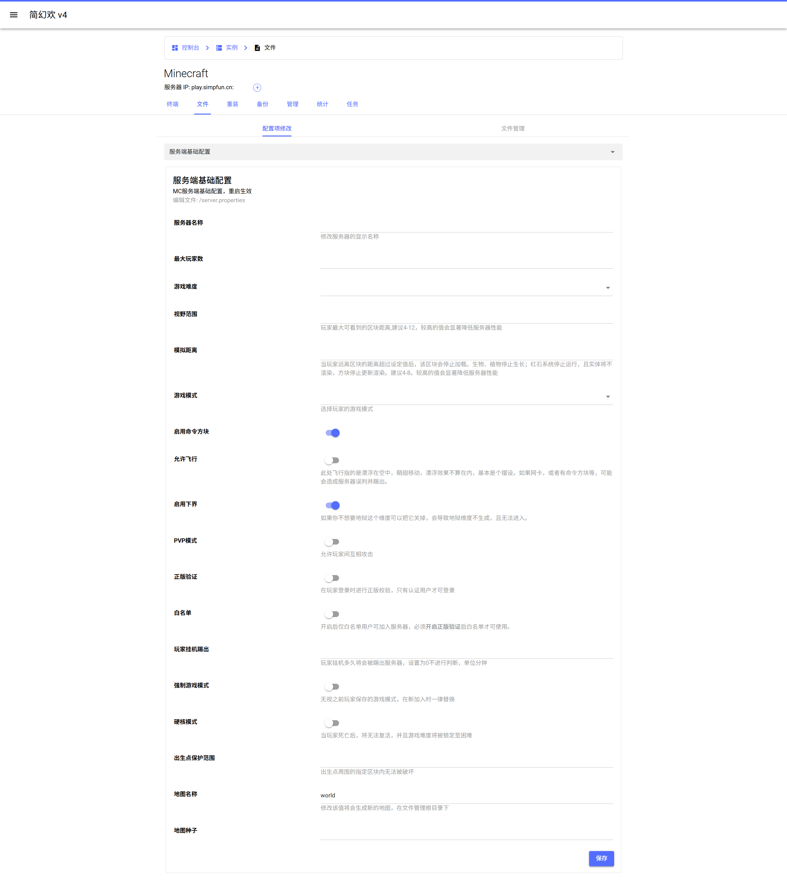
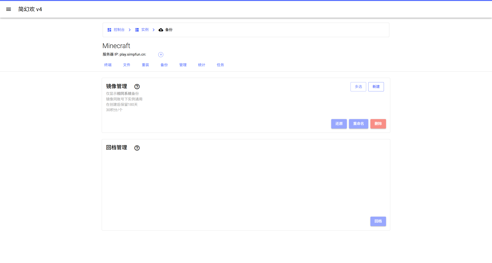
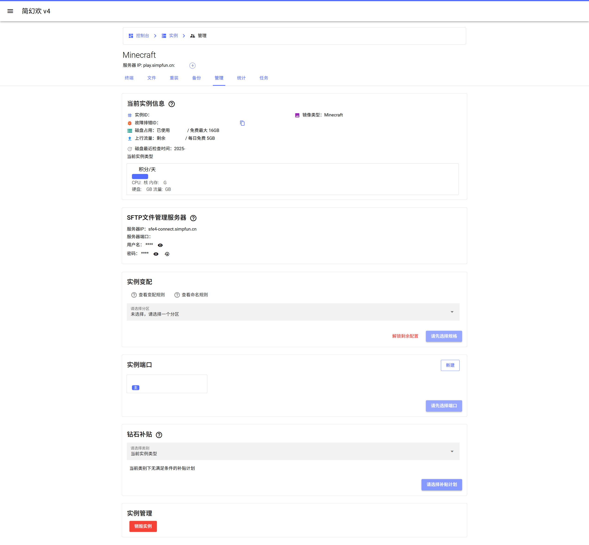

# <i class="fa-solid fa-server"></i> 服务器搭建教程
<ArticleMetadata />

## 云服务器
### [简幻欢](https://simpfun.cn/)
- 注册账号并进入控制台
  

::: code-group

```md:img [新建实例]
  
```

```md:img [选择镜像类型]
  
  一般选基础镜像
```

```md:img [选择实例类别]
  
```

```md:img [选择实例服务端]
  
```
```md:img [选择实例版本]
  
```

```md:img [选择实例规格]
  
```

:::

- 最后确认信息并创建
- 服务器管理
  ::: code-group
  ```md:img [终端]
    
  ```

  ```md:img [文件]
    
  ```

  ```md:img [备份]
    
  ```

  ```md:img [管理]
    
  ```

  ```md:img [统计]
    
  ```
  :::

::: tip
支持原版服、模组服、插件服、互通服<br>
[官方教程文档 | 如何创建服务器](https://www.yuque.com/simpfox/simpdoc/create)
:::

### [雨云](https://app.rainyun.com/)
<BilibiliVideo bvid="BV1FJZSY4E9K" />

## 手动搭建
- Forge 服务器
  <BilibiliVideo bvid="BV11w4m1a7hs" />
- Fabric 服务器
  <BilibiliVideo bvid="BV1EJHueqE2k" />